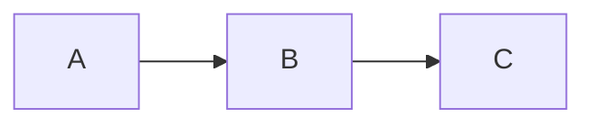

# Engineering OS

A multilingual (English/French) Jekyll blog hosted on GitHub Pages at [pierremary.com](https://pierremary.com).

## Prerequisites

- [Ruby](https://www.ruby-lang.org/en/documentation/installation/)
- [Bundler](https://bundler.io/) (`gem install bundler`)
- [Jekyll](https://jekyllrb.com/) (`gem install jekyll`)

## Local Development

```bash
bundle install
bundle exec jekyll serve
```

The site will be available at `http://localhost:4000`.

## Project Structure

```
├── _config.yml          # Site configuration (title, URL, permalinks, defaults)
├── _data/
│   └── translations.yml # UI text translations (en/fr)
├── _includes/           # Reusable template partials (header, footer, head, etc.)
├── _layouts/            # Page templates (default, post, page)
├── _posts/
│   ├── en/              # English blog posts
│   └── fr/              # French blog posts
├── _sass/               # SCSS stylesheets (modular, includes dark mode)
├── assets/
│   ├── js/              # JavaScript (search, theme switcher)
│   ├── icons/           # Favicon and icons
│   └── posts/           # Post images (one folder per post)
├── css/                 # Compiled CSS entry point
├── en/                  # English pages (home, about, resources, archive)
├── fr/                  # French pages (home, about)
├── feed.xml             # RSS feed template
├── sitemap.xml          # Sitemap template (with hreflang)
├── search-index.json    # Search index template for Lunr.js
├── CNAME                # Custom domain (pierremary.com)
└── Gemfile              # Ruby dependencies
```

## i18n

### Translations

Text translations are stored as YAML files in the `_data` folder.
Example:
```yaml
posts:
  en: Posts
  fr: Articles
```

```liquid
{{ translations.posts[page.language] }}
```

### Multilingual Pages

Pages are duplicated per language in their respective directories, each declaring its `language` in front matter:

```
en/
  ├── home.md        # language: en
  ├── about.md       # language: en
  ├── resources.md   # language: en
  └── archive.md     # language: en
fr/
  ├── home.md        # language: fr
  └── about.md       # language: fr
```

Example front matter for a page:
```yaml
---
layout: page
title: About
language: en
---
```

The `language` field controls which translations are used in the layout and which navigation links are shown.

### Multilingual Posts

Posts are organized into language-specific subdirectories under `_posts/`. The `language` value is **automatically assigned** by `_config.yml` defaults based on the file path — you don't need to set it in front matter:

```yaml
# _config.yml
defaults:
- scope:
    path: '_posts/en'
    type: 'posts'
  values:
    permalink: 'en/posts/:title'
    language: en
- scope:
    path: '_posts/fr'
    type: 'posts'
  values:
    permalink: 'fr/posts/:title'
    language: fr
```

To link posts across languages, use the **same filename** in both directories. The language banner automatically discovers the alternate version by swapping the language segment in the URL (`/en/posts/:title` ↔ `/fr/posts/:title`).

## Creating a Post

Add a Markdown file to `_posts/en/` or `_posts/fr/` with the naming convention `YYYY-MM-DD-title-slug.markdown`.

### Front Matter

```yaml
---
layout: post
title: "Post Title"
date: 2026-01-15 09:00:00
categories: engineering leadership
comments: true
image: '/assets/posts/2026-01-15-post-slug/header.png'
description: "A short description for SEO and excerpts."
---
```

| Field         | Required | Description                                              |
|---------------|----------|----------------------------------------------------------|
| `layout`      | Yes      | Always `post`                                            |
| `title`       | Yes      | Post title                                               |
| `date`        | Yes      | Publication date (`YYYY-MM-DD HH:MM:SS`)                |
| `categories`  | No       | Space-separated category list                            |
| `comments`    | No       | Set to `true` to enable Disqus comments                  |
| `image`       | No       | Path to a header/social image                            |
| `description` | No       | Short description for meta tags and excerpts             |
| `draft`       | No       | Set to `true` to mark as draft (see below)               |
| `archived`    | No       | Set to `true` to flag as archived                        |

### Post Images

Store images in a dedicated folder matching the post filename:

```
assets/posts/YYYY-MM-DD-post-slug/
  ├── header.png
  └── other-image.png
```

## Draft Posts

Posts can be marked as drafts by adding `draft: true` to the front matter:

```yaml
---
title: "My Post"
draft: true
---
```

When a post is marked as draft:

- A **"DRAFT" banner** is displayed at the top of the post page
- A `<meta name="robots" content="noindex, nofollow">` tag is added to prevent search engine indexing
- The post is **excluded** from the sitemap, RSS feed, home page, and archive listings

To publish, simply remove `draft: true` from the front matter. The post will immediately appear in all listings and become indexable by search engines.

## Features

### Search

Client-side full-text search powered by [Lunr.js](https://lunrjs.com/). A search index is generated at build time from `search-index.json`. Users can open the search modal from the header.

### Dark Mode

Three theme modes are available: **Auto** (follows OS preference), **Light**, and **Dark**. The toggle is in the footer. User preference is stored in `localStorage` and applied before first paint to avoid flashes.

### MathJax

Mathematical equations are supported via [MathJax 2.7](https://www.mathjax.org/). Use standard LaTeX syntax in posts:

```
$$ E = mc^2 $$
```

### Mermaid Diagrams

[Mermaid](https://mermaid.js.org/) diagrams are supported. Use fenced code blocks with the `mermaid` language tag:

````

````

### Comments

[Disqus](https://disqus.com/) comments are loaded on posts with `comments: true` in front matter. Comments are disabled when running on localhost.

## Conventions

[Conventional Commits](https://www.conventionalcommits.org/en/v1.0.0/)
