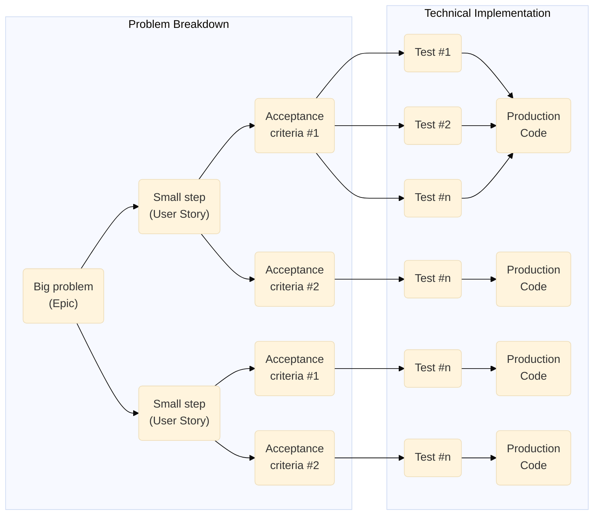
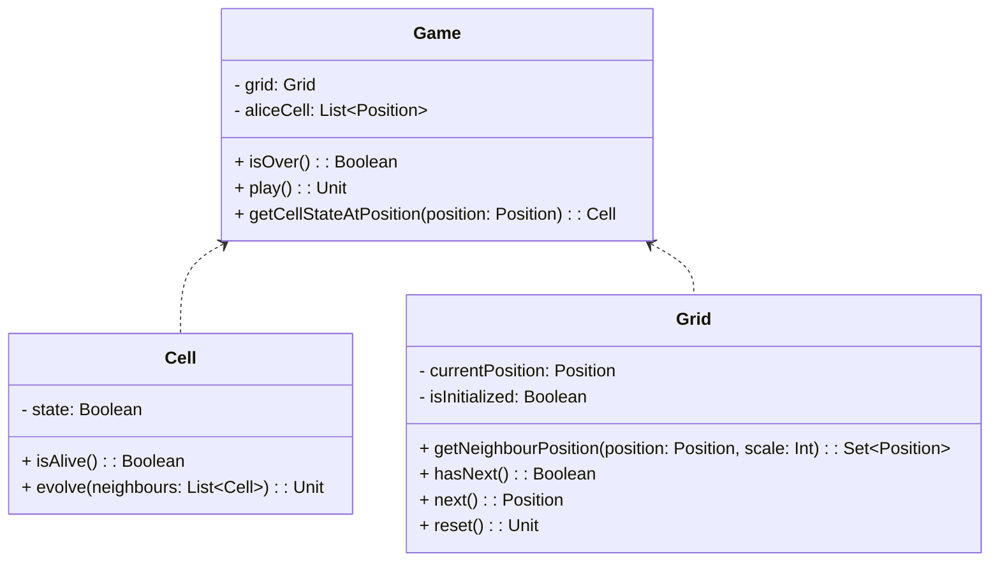

<style>
img {
    display: block;
    margin-left: auto;
    margin-right: auto;
}
img.grid-fig {
    max-width: 400px;
}

</style>

> Dans cet article, pour des raisons de lisibilité, nous ne montrerons pas les étapes incrémentales du cycle rouge / vert / refactor mais uniquement le résultat final pour chaque critère d’acceptance. Vous pouvez retrouver le code complet sur [GitHub](https://github.com/pmary/kata-tdd-game-of-life-kotlin) et suivre les étapes incrémentales dans les [commits](https://github.com/pmary/kata-tdd-game-of-life-kotlin/commits/main).

L'objectif de ce Kata est d'écrire un programme qui prends en entrée une grille de cellules arbitraire et qui retourne la grille à la génération suivante.  
Nous adopterons une approche TDD en Kotlin avec le framework de test JUnit 5.
Notez que nous allons implémenter le jeu de la vie en mode console, mais vous pouvez très bien l'adapter pour l'afficher dans une interface graphique.

## Présentation du jeu de la vie
Le jeu de la vie est un automate cellulaire imaginé par John Horton Conway en 1970. Il s'agit d'un jeu à zéro joueur, ce qui signifie que son évolution est déterminée par son état initial et ne nécessite aucune intervention de la part d'un humain. Le jeu se déroule sur une grille à deux dimensions, théoriquement infinie (mais de longueur et de largeur finies et plus ou moins grandes dans la pratique), dont les cases — qu’on appelle des « cellules », par analogie avec les cellules vivantes — peuvent prendre deux états distincts : « vivante » ou « morte ». À chaque étape, l’évolution d’une cellule est entièrement déterminée par l’état de ses voisines de la façon suivante : 
- une cellule vivante avec moins de deux voisines vivantes meurt (elle meurt d’isolement)  


- une cellule vivante avec plus de trois voisines vivantes meurt (elle meurt de surpopulation)


- une cellule vivante avec deux ou trois voisines vivantes le reste à la génération suivante


- une cellule morte avec exactement trois voisines vivantes devient vivante (elle naît par reproduction)


Contraintes supplémentaires :  
- L’évolution est appliquée simultanément à toutes les cellules et non une par une.  
- Une cellule à pour voisines toutes les cellules adjacentes horizontalement, verticalement et en diagonale, soit un maximum de huit voisines et un minimum de trois pour les cellules d'angle (dit autrement, on considére les cellules situées hors de la grille comme mortes). Par exemple, la cellule du centre a 8 voisins, celle en bas à droite en a 3.  

## Les étapes du Kata: Découper le problème
Avant d'écrire la moindre ligne de code, nous devons réfléchir à la façon dont nous allons découper le problème et l'ordre dans lequel nous allons implémenter ces étapes. Comme toujours dans ce genre d'exercice, il s'agit de trouver la plus petite tâche indépendante.  
Pour chacune des étapes nous allons écrire les critères d'acceptance qui nous permettrons par la suite de valider que nous avons bien implémenté la fonctionnalité attendue.  
Ensuite, nous pouvons réfléchir à la solution technique en commençant par concevoir le diagramme de classe. A ce stade, sur un projet plus important, on pourrait égallement réaliser une phase de POC et de benchmark afin de tester différentes approche et avoir une idée plus claire de comment on souhaite répondre au problème.  

Tout cela nous guidera lors de l'implémentation, d'autant plus avec une approche une approche TDD. On peut être tenté de passer directement à l'implémentation pour gagner du temps ou par excés de confiance mais en réalité on en perd beaucoup plus a chaque de mauvaises décisions prises trop rapidement. Implémenter sans phase de conception, c'est un réaliser un brouillon (ou POC) et en faire le code de production. On prend alors le risque de se retrouver avec un existant difficilement maintenable et qui ne répond pas aux besoins du client. Imaginez un architecte qui préfère commencer directement à la construction d'un immeuble sans avoir fait de plan au préalable. Il y a de fortes chances que l'immeuble ne soit pas aux normes et qu'il ne réponde pas aux besoins des futurs habitants. Il en va de même pour le code.

<style>
  .clusters .flowchart-label .nodeLabel{
    font-weight: 800;
    font-size: 18px;
  }
  .clusters #subGraph0.flowchart-label rect{
    fill: #ceede7;
  }
  .clusters #subGraph1.flowchart-label rect{
    fill: #cdeffd;
  }
  .node.default.default.flowchart-label rect {
    fill: #ffffff !important;
    stroke: #000 !important;
  }
</style>


Dans la prochaine section, nous allons définir les critères d'acceptance. Ils doivent décrire le périmètre du problème afin que les développeurs puissent estimer les efforts correctement et se baser dessus pour implémenter sans avoir à poser de questions au client. On évite les détails techniques et on se concentre sur le comportement attendu.  

### Etape 1: La cellule
Puisqu'une grille est composée de cellules, nous devons commencer par concevoir celle-ci.

#### Critère d'acceptance 1
Etant donné une cellule, lorqu'elle elle créée, vivante ou morte, on doit pouvoir connaitre son état.

#### Critère d'acceptance 2
Etant donné une cellule, lorsqu'elle évolue, alors sont nouvel état est mis à jour par rapport à ces cellules voisines dans le respect des contraintes d'évolution.  

### Etape 2: La grille

#### Critère d'acceptance 1
Etant donné une grille, lorsque je la parcours, je dois pouvoir connaitre les positions des cellules voisines d'une cellule donnée.

#### Critère d'acceptance 2
Etant donné une grille, lorsque je la parcours, je dois pouvoir savoir pour une position donnée si la prochaine position existe ou non.

### Etape 3: Le jeu
Après la cellule et la grille, nous pouvons maintenant passer au jeu en lui même.

#### Critère d'acceptance 1
Etant donné une nouvelle partie, lorsqu'il n'y a aucune cellule vivante avant la première évolution, alors la partie est terminée.  

#### Critère d'acceptance 2
Etant donné une nouvelle partie, lorsqu'il y a au moins une cellule vivante avant la première évolution, alors la partie n'est pas terminée.  

#### Critère d'acceptance 3
Etant donné une nouvelle partie, lorsqu'il y a au moins une cellule vivante avant la première évolution, alors la partie est terminée a la prochaine évolution.  


Le test :
```kotlin
class GameTest {
  @Test
  fun `Given a new game, When there is no living cell before the first evolution, Then the game is over`(){
    val grid = Grid(3, 3)
    val game = Game(grid, emptyList<Position>())
    assertThat(game.isOver()).isTrue
  }
}
```

Le code
```kotlin
class Game {
  constructor(
    grid: Grid,
    aliveCell: List<Position>
  ) {
    this.grid = grid
    this.aliveCell = aliveCell
  }

  private val grid: Grid
  private var aliveCell: List<Position>

  fun isOver() : Boolean {
    return true
  }
}
```

Vous aurez remarqué que la méthode `isOver` ne fait que retourner `true`. C'est une implémentation très naïve qui ne gère __que__ le cas où il n'y a aucune cellule vivante. Nous aurions pu directement écire la logique pour le cas contraire mais si on suit les principes du TDD, nous ne devons écrire que le minimum de code nécessaire pour que le test passe au vert. Nous implémenterons l'autre cas dans le critère d'acceptance suivant.

#### Critère d'acceptance 2
Etant donné une nouvelle partie, lorsqu'il y a au moins une cellule vivante avant la première évolution, alors la partie n'est pas terminée.

Le test :
```kotlin
@Test
fun `Given a new game, When there is at lease one living cell, Then the game is not over`(){
  val grid = Grid(3, 3)
  val game = Game(grid, listOf(Position(0,0)))
  assertThat(game.isOver()).isFalse
}
```

Le code
```kotlin
// ...

fun isOver() : Boolean {
  return aliveCell.isEmpty()
}

//...
```

#### Critère d'acceptance 3
Etant donné une partie, lorsqu'il n'y a qu'une seule cellule vivante, alors la partie est terminée à la prochaine évolution.

## Les tests

### La cellule


Le test :
```kotlin
@Test
fun`Given a new game, When there is one living cell, Then after the next evolution the game is over`(){
  //Given
  val grid = Grid(3, 3)
  val game = Game(grid, listOf(Position(0,0)))

  // When
  game.play()

  //Then
  assertThat(game.isOver()).isTrue
}
```

Le code :
```kotlin
class Game {
    constructor(
        grid: Grid,
        aliveCell: List<Position>
    ) {
        this.grid = grid
        this.aliveCell = aliveCell
    }

    private val grid: Grid
    private var aliveCell: List<Position>

    fun isOver() : Boolean {
        return aliveCell.isEmpty()
    }

    fun play(){
        val aliveCellPositionForCurrentTurn : MutableList<Position> = mutableListOf()
        while(grid.hasNext()){
            val position = grid.next()
            val neighbour = grid.getNeighbourPositions(position,1).map { p -> getCellStateAtPosition(p)}
            val cell = getCellStateAtPosition(position)
            cell.evolve(neighbour)
            if(cell.isAlive()){
                aliveCellPositionForCurrentTurn.add(position)
            }
        }
        aliveCell = aliveCellPositionForCurrentTurn
    }

    private fun getCellStateAtPosition(position: Position): Cell{
        if(aliveCell.contains(position)){
            return Cell(CellState.ALIVE)
        } else {
            return Cell(CellState.DEAD)
        }
    }
}

class Grid(private val rows: Int, private val cols: Int) {
    private var currentPosition = Position(0, 0)
    private var isInitialized = false

    fun getNeighbourPositions(position: Position, scale: Int): Set<Position> {
        val neighbourPositions = mutableSetOf<Position>()

        for (i in -1 * scale..scale) {
            for (j in -1 * scale..scale) {
                if (i == 0 && j == 0) continue
                val newX = position.x + i
                val newY = position.y + j
                if (newX in 0 until rows && newY in 0 until cols) {
                    neighbourPositions.add(Position(newX, newY))
                }
            }
        }
        return neighbourPositions
    }

    fun hasNext(): Boolean {
        return currentPosition.x < rows && currentPosition.y < cols
    }

    fun next(): Position {
        if (!isInitialized) {
            isInitialized = true
        }

        val position = currentPosition.copy()

        currentPosition.y++
        if (currentPosition.y == cols) {
            currentPosition.y = 0
            currentPosition.x++
        }
        return position
    }
}
```

Ici, nous devons mettre à jour le code de la classe `Game` mais égallement celui de la classe `Grid` afin d'implémenter les méthodes permettant d'itérer sur les positions de la grille (`hasNext()` et `next()`). On pourrait être tenté d'écrire des tests pour ces méthodes. Pour cela il nous faudrait soit écrire un test qui vérifie pour toutes les positions possibles que le résultat attendu est le bon, soit permettre de mettre à jour la variable `currentPosition`. Dans les deux cas, nous aurions un test très verbeux et qui ne nous apporterait pas grand chose. En effet, nous avons déjà écrit des tests pour la classe `Grid` qui nous permettent de valider que les méthodes `hasNext()` et `next()` fonctionnent correctement. Nous pouvons donc nous passer de ces tests et nous concentrer sur la classe `Game`. De plus, 
Ici, nous devons mettre à jour le code de la classe `Game` mais égallement celui de la classe `Grid` afin d'implémenter les méthodes permettant d'itérer sur les positions de la grille (`hasNext()` et `next()`). On pourrait être tenté d'écrire des tests pour ces méthodes. Pour cela il nous faudrait soit écrire un test qui vérifie pour toutes les positions possibles que le résultat attendu est le bon, soit permettre de mettre à jour la variable `currentPosition`. Dans les deux cas, nous aurions un test très verbeux et qui ne nous apporterait pas grand chose. En effet, nous avons déjà écrit des tests pour la classe `Grid` qui nous permettent de valider que les méthodes `hasNext()` et `next()` fonctionnent correctement. Nous pouvons donc nous passer de ces tests et nous concentrer sur la classe `Game`. Avec un test unitaire, nous voulons vérifier le comportement d'une classe, pas comment elle l'implémente. Les variables privées font partie de l'implémentation, les tests doivent se concentrer sur le comportement plutôt que sur les détails d'implémentation.

#### Critère d'acceptance 4
Etant donné partie dont les seules cellules vivantes sont disposées sur une même ligne horizontale, lorsque j'appelle la méthode `play`, alors les cellules vivantes forment une ligne verticales à la génération suivante.

```kotlin
@Test
fun `Given a new game, When living cells filling an horizontal line, Then after the next evolution they form a vertical line`() {
  // Given
  val grid = Grid(3, 3)

  // When
  val initialAliveCells = listOf(
    Position(1, 0), Position(1, 1), Position(1, 2)
  )
  val game = Game(grid, initialAliveCells)
  
  assertThat(game.getCellAtPosition(Position(1, 0)).isAlive()).isTrue
  assertThat(game.getCellAtPosition(Position(1, 1)).isAlive()).isTrue
  assertThat(game.getCellAtPosition(Position(1, 2)).isAlive()).isTrue

  // Then
  game.play()

  assertThat(game.getCellAtPosition(Position(0, 1)).isAlive()).isTrue
  assertThat(game.getCellAtPosition(Position(1, 1)).isAlive()).isTrue
  assertThat(game.getCellAtPosition(Position(2, 1)).isAlive()).isTrue
}
```

#### Critère d'acceptance 5
Etant donné partie dont les seules cellules vivantes sont disposées sur une même ligne verticale, lorsque j'appelle la méthode `play`, alors les cellules vivantes forment une ligne horizontale à la génération suivante.



class Grid(private val rows: Int, private val cols: Int) {
  // ...

  fun reset() {
        currentPosition = Position(0, 0)
        isInitialized = false
    }

  // ...
}

class Game {
  // ...

  fun play(){
        val aliveCellPositionForCurrentTurn : MutableList<Position> = mutableListOf()
        while(grid.hasNext()){
            val position = grid.next()
            val neighbour = grid.getNeighbourPositions(position,1).map { p -> getCellStateAtPosition(p)}
            val cell = getCellStateAtPosition(position)
            cell.evolve(neighbour)
            if(cell.isAlive()){
                aliveCellPositionForCurrentTurn.add(position)
            }
        }
        aliveCell = aliveCellPositionForCurrentTurn
        grid.reset()
    }

  // ...
}


## Diagramme de classe
Durant la phase de design, nous pouvons réaliser un diagramme de classe. Le réaliser en amont du code nous permet de réfléchir à la conception de notre application et de nous assurer que nous n'oublions pas de cas d'usage. Il nous permet également de réfléchir à la façon dont les classes vont interagir entre elles et de définir les dépendances entre elles. Ces décisions sont importantes car elles auront un impact sur la maintenabilité de notre code. Commencer l'implémentation avec uniquement les informations présentes à notre esprit à ce moment là pourrait être mettre toute l'équipe sur de mauvais rails et la forcerait à avancer sans savoir exactement ou l'on va.



_Légende :_  
- _`+` : attribut / méthode publique_
- _`-` : atribut / méthode privée_
- _`#` : attribut / méthode protégée_
- _Unit signifit que la méthode ne retourne rien (void en Java)._

Ce diagramme de classe montre que `Game` dépends des classes `Grid` et `Cell` mais que celles-ci ne dépendent pas de `Game`. Cela signifie :  
- Qu'un changement dans `Game` n'impliquera pas de changement dans `Grid` et `Cell`
- Qu'un changement dans `Grid` ou `Cell` pourrait impliquer un changement dans `Game`


La classe nommée `Cell` ne prendra qu'un seul paramètre : `cellState`, qui sera `Alive` ou `DEAD`. Elle ne connaitra pas sa position sur la grille, cette information sera portée par la grille. De cette façon, ne crée aucune dépendance entre `Grid` et `Cell`.  : `x` et `y` qui représentent ses coordonnées dans la grille. Elle possèdera également une méthode `isAlive` qui retournera `true` si la cellule est vivante et `false` sinon. Elle aura égallement une méthode `evolve` qui se chargera de retourner le bon état suivant le contexte.

En suivant les principes du TDD, pour chaque test, on écrit le minimum de code pour qu'il passe avant de le refactoriser et de passer au prochain. Au final, on obtient le code suivant :
```kotlin
enum class CellState {
  ALIVE, DEAD
}

class Cell(private var cellState: CellState) {
  private var state = cellState

  fun isAlive(): Boolean {
    return state == CellState.ALIVE
  }
}
```

Maintenant que nous avons la cellule, nous pouvons concevoir la grille. Elle prendra la forme d'une classe nommée `Grid` qui prendra en paramètre le nombre de lignes et de colonnes. Cette grille sera utilisée dans le cadre d'un jeu et devra proposer des fonctionalités permettant de récupérer les positions des voisines d'une cellule, d'obtenir la prochaine position à pointer et de savoir si la prochaine position existe ou bien si nous sommes arrivé au bout de la grille et de revenir à la position initiale (le début de la grille, x: 0, y:0).  

Dans cette approche, la grille n'aura donc aucune connaissance des cellules qui la compose, elle ne fera que fournir des informations sur leur position, ce qui évite de créer une dépendance les classes `Grid` et `Cell`. Ce sera à la classe `Game` (représentant une partie) de se charger de garder en mémoire les positions des cellules vivantes.

## Conclusion